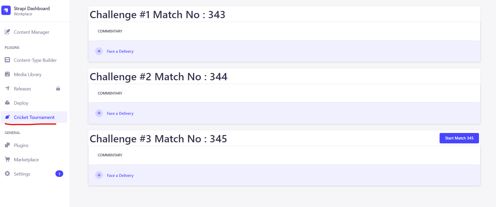
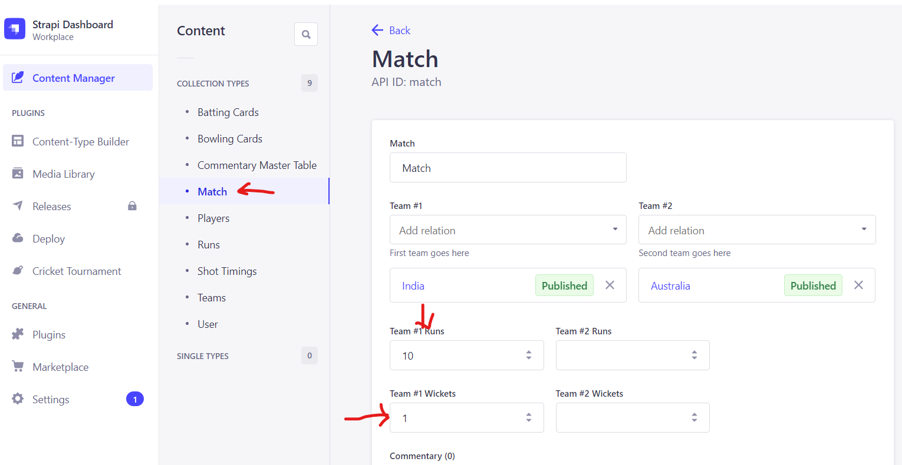
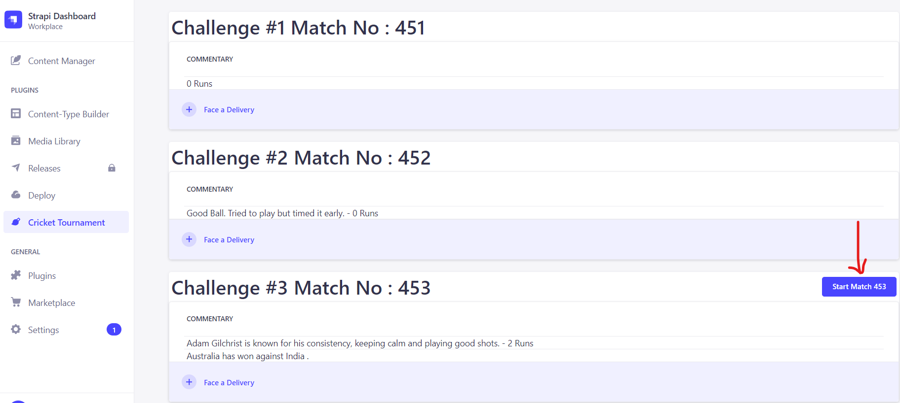

# 🚀 Introduction

The project is built using node js (v18.17.1). An open source node CMS called Strapi is used in aiding the developmen of the project. Currently the application is run using sqlite database to ease the running of applicatins for the reviewers. Ideally this would be done using a database postgresql.

### `Setting up the Project`

The project can be set up using the source code supplied or by running a docker image directly. Running the docker is recommended for easy run of the application.

### `1. Running using Docker`

Pull the image image_name and do a host port mapping. The docker image is configured to run on port 1337.

```
docker pull pankajdalvi1893/
```

### `2. Running on local machine`

Take the source code supplied and install the npm dependencies with the following command. 

```
npm install
```

Once dependencies are installed use the build command to build the application. 

```
npm run build
```

Start the application in development mode. To start in production the command is npm run start.

```
npm run develop
```

If you are planning to run the unit tests you can run the below command.

```
npm run test
```

### `3. The Plugin Application`

Once the project is successfully up and running log in to the application using the username and password provided over the email. Once in the application navigate to Cricket Tournament left side menu link and start your cricket match. 



### `4. Starting Challenge #3`

Before starting Challenge #3 you will need to create a target and wickets in the Match Collection. Search for the id shown on Challenge #3 save button and modify the collection to set target runs for Team #2



Once the target is set , click on Start Match button on Challenge #3 tab. Once done you can play ball by ball clicking on Face a Ball button.




## 📚 Learn more

- [Resource center](https://docs.strapi.io/dev-docs/intro) - Strapi Developer Documentation.

---

<sub>🤫 Happy Cricketing.</sub>
